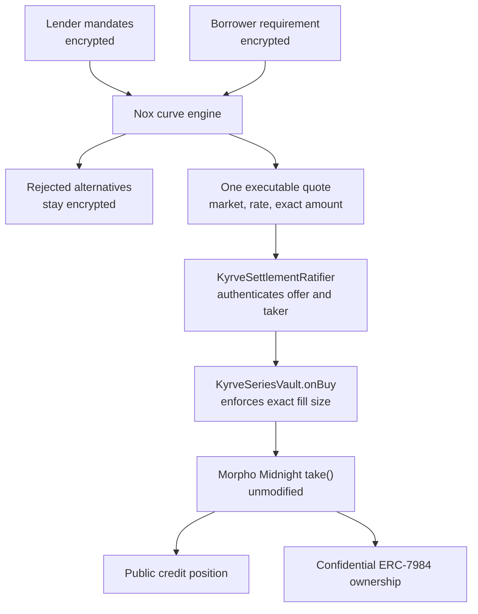
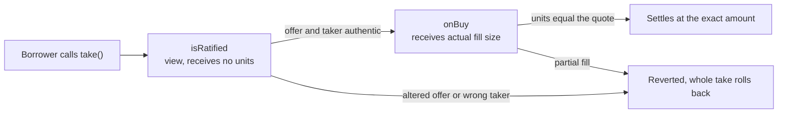
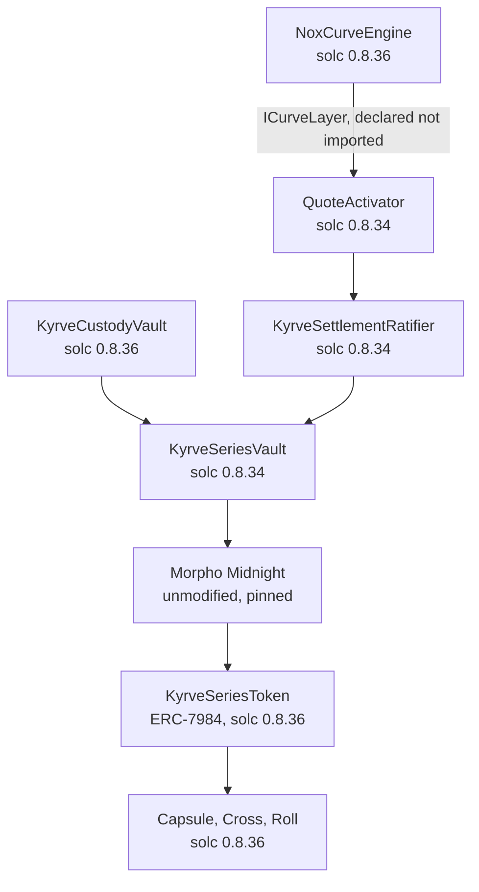

# Kyrve

Confidential fixed-income liquidity on iExec Nox, settling on unmodified Morpho Midnight.

Lenders set private terms. Borrowers ask the market privately. Kyrve reveals one executable quote and
settles it exactly.

> One quote. The curve stays private.

**Live:** https://kyrve.timjosh507.workers.dev
**Chain:** Ethereum Sepolia
**Demo video:** (link added at submission)

### 👉 [**How to use Kyrve**](USING-KYRVE.md) — every page, what it does, what to click

Nineteen routes and four confidentiality states take some orienting. That guide walks the provider
journey, the borrower journey and the verification surface page by page, and says plainly which
things this deployment does not have so nothing reads as broken when it is not.

**The fastest way to judge this project needs no wallet at all.** Open
[`/proof`](https://kyrve.timjosh507.workers.dev/proof) and click **Deployment**. It recomputes every
published fact from chain state in your browser, names the block it read, and reports four verdicts
rather than two — `recomputed`, `failed`, `not deployed here`, and `reported, not verified here`.
The last two exist because calling an unrun check a pass or a failure would be a lie in one
direction or the other.

---

## The problem

A lender who posts a full curve has published their position. Anyone reading it learns which markets
they will touch, how much they can deploy and the rate below which they stop. A borrower who shops a
requirement publishes what they need before anyone quotes them.

In fixed income both of those are the strategy itself. The usual answer is a private venue with a
trusted operator. Kyrve's answer is that the computation runs on encrypted values, and the only thing
that becomes public is the offer that settles.

## How it works



Every alternative the engine considered stays encrypted. A rejection produces no public reason,
because a confidential failure that explained itself would let anyone probe the book by asking.

The two enforcement points are not redundant. `isRatified` is a `view` and never receives `units`, so
it can authenticate an offer and can never enforce fill size. Midnight itself permits
`newConsumed <= offer.maxUnits`. `onBuy` is the only place actual fill size reaches maker code, so
exact fill is enforced there.



## Contract layers

Two compiler pins that cannot be reconciled, so they are two projects that talk through a declared
interface. `nox-protocol-contracts` needs `^0.8.35`; the Midnight substrate is pinned at 0.8.34 so
its bytecode stays comparable with the pinned release.



## Live on Ethereum Sepolia

**56 of 56 contracts verified on Etherscan.** Two complete confidential issuance stacks sharing zero
contracts, plus a market layer of three.

| Contract | Address |
|---|---|
| Morpho Midnight (pinned, unmodified) | [`0xA8774FEba…`](https://sepolia.etherscan.io/address/0xA8774FEba7DDCAdcE4C299c3EC376B8ef447B2d7#code) |
| `NoxCurveEngine` | [`0xb2be4575c…`](https://sepolia.etherscan.io/address/0xb2be4575c78b8f6be1bc84d54ece9f0da643010a#code) |
| `KyrveCustodyVault` | [`0xcd4161de1…`](https://sepolia.etherscan.io/address/0xcd4161de15c52da9e5f51dbe4488a5020604d6f2#code) |
| `KyrveSettlementRatifier` | [`0xa0bdd96d9…`](https://sepolia.etherscan.io/address/0xa0bdd96d999f6f7641dd0f78f6a5b6b5ede6eabc#code) |
| `QuoteActivator` | [`0x0d7e61d9f…`](https://sepolia.etherscan.io/address/0x0d7e61d9febe5b44114eebf2d20b54fb341e5c14#code) |
| `KyrveSeriesToken` | [`0x61fcb2a76…`](https://sepolia.etherscan.io/address/0x61fcb2a7623bb15622b1303d0bf819247078f178#code) |

Full manifests: [`deployments/sepolia/`](deployments/sepolia/).

**What has actually run on Sepolia**, each with an evidence record in [`evidence/`](evidence/):

| Stage | Evidence |
|---|---|
| Confidential curve epoch, matching the plaintext reference model | [`sepolia-epoch-a.json`](evidence/phase6/sepolia-epoch-a.json) |
| Quote activation, a partial fill refused, then exact settlement | [`sepolia-activation-a.json`](evidence/phase6/sepolia-activation-a.json) |
| Confidential series ownership allocated to two providers | [`sepolia-allocation-a.json`](evidence/phase6/sepolia-allocation-a.json) |
| Frozen selective disclosure (Capsule) | [`sepolia-capsule.json`](evidence/phase6/sepolia-capsule.json) |
| Confidential secondary transfer (Cross) | [`sepolia-cross.json`](evidence/phase6/sepolia-cross.json) |
| Confidential migration between maturities (Roll) | [`sepolia-roll.json`](evidence/phase6/sepolia-roll.json) |

## Verify it yourself

The verification pages recompute every published claim from chain state in your own browser. The
deployment record supplies addresses and is never the source of a verdict. Where a record and the
chain disagree, the row fails and shows both values.

- https://kyrve.timjosh507.workers.dev/proof/deployment
- https://kyrve.timjosh507.workers.dev/proof

That property is proven the only way it can be. A test rewrites the served record with a false series
id and requires the page to turn that row red on its own
([`130-roll.ts`](confidential/test/130-roll.ts), demonstration 24).

Verdicts have four values, and two of them are neither pass nor fail. `unavailable` means the check
could not run. `reported-not-verified` means a record asserts something this browser did not check,
which is where the Etherscan counts and the static-analysis gap are listed rather than dropped.

### The evidence is committed, and proven to carry nothing private

Every record in [`evidence/`](evidence/) is in this repository so you can check a claim without
running anything or trusting us. On a confidentiality product that invites the obvious question, so
it is answered by a scan rather than by assurance.

`pnpm exec tsx scripts/verify/privacy-scan.ts` reads
[`confidential/test/private-fixtures.json`](confidential/test/private-fixtures.json) — the values
the suite actually decrypted — and greps the whole repository for each one. Three things make it
mean something:

- **It fails if the fixture file is missing.** A scanner that cannot know what was decrypted has not
  passed; it has failed to run.
- **The private and public sets must be disjoint.** A wrap amount is a plain `uint256` in calldata
  and public the moment it is sent, so it is listed as public by construction. The scan refuses any
  value that appears in both lists, which means a leak cannot be silenced by reclassifying it.
- **It says what it cannot check.** Rate indexes, enabled flags and allocation weights are integers
  between 0 and 100; grepping a repository for `12` proves nothing. Those rest on the structural half
  instead: no code path can write a decrypted value anywhere at all — no console, fetch, file or
  storage sink on the decryption path, and no Worker or script imports it.

## Install and run

Requirements: Node 22 or newer, pnpm 10.33.0, Docker (for the Nox stack), Foundry.

```bash
git clone <this repository>
cd kyrve
pnpm install

cp .env.example .env      # fill in ALCHEMY_API_KEY to talk to Sepolia
pnpm build
```

**Run the web product against the live Sepolia deployment:**

```bash
pnpm generate                    # derives the served record from the Sepolia manifests
pnpm --filter @kyrve/web build
pnpm web:preview                 # http://127.0.0.1:4173
```

**Run the full confidential stack locally.** This boots a Hardhat node, NoxCompute, the KMS, the
ingestor, the runner, the gateway and the Midnight substrate in Docker, then drives a whole epoch
against them:

```bash
cd confidential
npx hardhat test test/80-curve-epoch.ts         # a confidential epoch, end to end
npx hardhat test test/91-settlement-browser.ts  # activation, refused partial fill, exact settlement
npx hardhat test test/101-series-browser.ts     # confidential ownership in two browser contexts
```

**Gates:**

```bash
pnpm verify:phase7      # 25 passed, 0 failed, 0 skipped
pnpm verify:ux-final    # 11 passed, 0 failed, 0 skipped
pnpm verify:kyrve       # recompute every published claim from Sepolia chain state
```

## Documentation

| Topic | Document |
|---|---|
| Feedback on the iExec Nox tools | [`feedback.md`](feedback.md) |
| Architecture and orientation | [`AGENTS.md`](AGENTS.md) |
| Product and architecture specification | [`kyrve-production-prd.md`](kyrve-production-prd.md) |
| Visual system | [`design.md`](design.md) |

**Security**

| Topic | Document |
|---|---|
| Threat model | [`docs/day0/THREAT-MODEL.md`](docs/day0/THREAT-MODEL.md) |
| Failure matrix | [`docs/day0/FAILURE-MATRIX.md`](docs/day0/FAILURE-MATRIX.md) |
| Confidential layer | [`docs/phase3/SECURITY.md`](docs/phase3/SECURITY.md) |
| Settlement layer | [`docs/phase4/SECURITY.md`](docs/phase4/SECURITY.md) |
| Series ownership | [`docs/phase5/SECURITY.md`](docs/phase5/SECURITY.md) |
| Market operations | [`docs/phase6/SECURITY.md`](docs/phase6/SECURITY.md) |
| Web product | [`docs/phase7/SECURITY.md`](docs/phase7/SECURITY.md) |
| Operational role separation | [`docs/phase6/ROLES.md`](docs/phase6/ROLES.md) |

**Adversarial testing**

Every defensive claim has a paired negative test that fails without the defence. When a revert is
asserted, it is asserted by decoded error name, because a test that passes for the wrong reason is
worse than no test.

| Suite | What it attacks |
|---|---|
| [`40-proof-attacks.ts`](confidential/test/40-proof-attacks.ts) | Input proof replay, wrong owner, wrong contract, expiry |
| [`81-curve-attacks.ts`](confidential/test/81-curve-attacks.ts) | Stale epochs, unauthorised stages, handle substitution |
| [`102-series-attacks.ts`](confidential/test/102-series-attacks.ts) | Double allocation, unauthorised minting |
| [`140-phase6-attacks.ts`](confidential/test/140-phase6-attacks.ts) | Capsule, Cross and Roll refusals, each by decoded name |
| [`ExactFill.t.sol`](contracts/integration/test/ExactFill.t.sol) | Partial fill against real unmodified Midnight |

Side channels: [`docs/phase1/GAS-SIDE-CHANNEL.md`](docs/phase1/GAS-SIDE-CHANNEL.md). No gas
indistinguishability is claimed, for any path in any phase.

**Verification and evidence**

| Topic | Document |
|---|---|
| Day 0 validation verdict | [`docs/day0/VERDICT.md`](docs/day0/VERDICT.md) |
| Source and version lock | [`docs/day0/SOURCE-LOCK.md`](docs/day0/SOURCE-LOCK.md) |
| Handle lineage and isolation | [`docs/phase3/HANDLE-LINEAGE.md`](docs/phase3/HANDLE-LINEAGE.md) |
| Phase gates | [`day0`](docs/day0/GATE.md) · [`1`](docs/phase1/GATE.md) · [`3`](docs/phase3/GATE.md) · [`4`](docs/phase4/GATE.md) · [`5`](docs/phase5/GATE.md) · [`6`](docs/phase6/GATE.md) · [`7`](docs/phase7/GATE.md) |
| Corrections to the specification | [`docs/phase7/PRD-DELTA.md`](docs/phase7/PRD-DELTA.md), and one delta file per phase |

## Licence

Kyrve's own contracts are **GPL-2.0-or-later**. Its packages, workers and tooling are MIT. See
[`LICENSE`](LICENSE).

> Kyrve is open-source software integrating an unmodified, source-available Morpho Midnight testnet
> replica under its applicable non-production licence.

Morpho Midnight is BUSL-1.1 and is not open source. Its Additional Use Grant was resolved on
2026-07-28 and found empty, so only non-production use is granted. Kyrve's Sepolia deployment is a
non-production testnet replica. It is not an official Morpho deployment, it is not maintained by
Morpho Association, and it carries no Morpho branding.

Midnight interfaces, libraries and periphery that Kyrve imports carry GPL-2.0-or-later, which is why
Kyrve's own contracts do too. Full per-dependency analysis:
[`docs/day0/LICENSE-MATRIX.md`](docs/day0/LICENSE-MATRIX.md). How the grant was resolved:
[`docs/phase1/MIDNIGHT-LICENCE.md`](docs/phase1/MIDNIGHT-LICENCE.md).

iExec Nox packages are used as published, unmodified.

## Originality

Kyrve was built entirely during this hackathon. It reuses no project from the previous VIBE Coding
Hackathon.

Two dependencies are pre-existing open-source work, both used unmodified and both pinned:

- **Morpho Midnight**, release `2026-07-23`, commit `dbd8d3d5`, in `vendor/midnight` as a submodule
  that is never edited. Kyrve deploys it unmodified and extends it with separate contracts.
- **iExec Nox**, `nox-protocol-contracts@0.2.4` with the published SDK and Hardhat plugin.

Everything in `contracts/kyrve/`, `confidential/contracts/`, `packages/`, `workers/`, `apps/web/` and
`scripts/` was written for this hackathon.

## What this is not

Not an offer of securities and not investment advice. The Midnight deployment is a testnet replica
under a non-production licence. There is no Nox mainnet.

Values published through the Nox handle gateway carry **decryption proofs**, which are EIP-712
signatures by the Nox KMS attesting that a handle decrypts to a value. They are not zero-knowledge
proofs and Kyrve never describes them as such.

The confidential contract layer has **no static-analysis coverage**. `crytic-compile` cannot be made
to drive solc 0.8.36, so Slither cannot reach it. Every gate run reports this as unverified rather
than folding it into a pass. The settlement layer, which Slither can reach, is analysed and clean.
